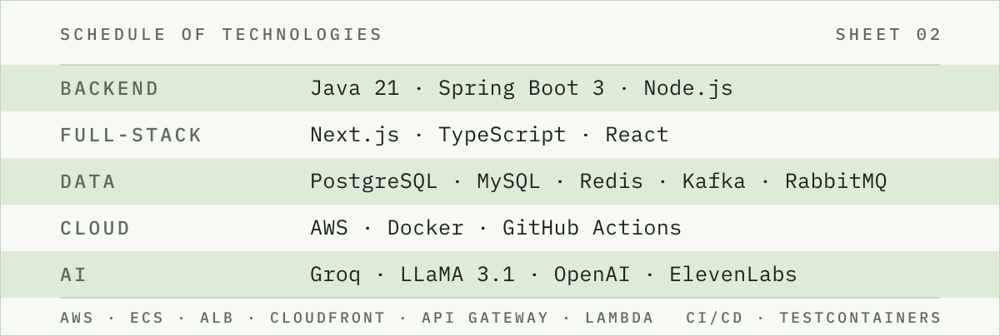

<picture>
  <source media="(prefers-color-scheme: dark)" srcset="assets/header-dark.svg">
  
</picture>

 

  <a href="https://www.linkedin.com/in/rodrigoscharp/"><picture><source media="(prefers-color-scheme: dark)" srcset="assets/chip-linkedin-dark.svg"></picture></a>
  <a href="https://instagram.com/rodrigoscharp"><picture><source media="(prefers-color-scheme: dark)" srcset="assets/chip-instagram-dark.svg"></picture></a>
  <a href="mailto:rodrigosharp99@gmail.com"><picture><source media="(prefers-color-scheme: dark)" srcset="assets/chip-email-dark.svg"></picture></a>

### About

Systems where a lost transaction is a real problem for a real person.

🏛️ &nbsp;**Ubatuba city government** — tech lead
&nbsp;&nbsp;&nbsp;&nbsp;`6+ systems shipped` &nbsp;`100k+ citizens served` &nbsp;`2 national awards`

⚡ &nbsp;**Athena Matching Engine** — order matching for financial markets
&nbsp;&nbsp;&nbsp;&nbsp;`100k orders/s` &nbsp;`p99 < 100µs` &nbsp;`lock-free`

🍔 &nbsp;**MUNO** — founder, food-tech
&nbsp;&nbsp;&nbsp;&nbsp;`backend + cloud infra, end to end`

☕ &nbsp;**Core stack** — 4+ years in production
&nbsp;&nbsp;&nbsp;&nbsp;`Java 21` &nbsp;`Spring Boot 3` &nbsp;`Next.js + TS when the product asks`

### What I build

**Financial engineering** &nbsp;`double-entry ledgers` `order matching` `atomic transfers` `idempotency`

**Distributed systems** &nbsp;`REST` `gRPC` `WebSocket` `Kafka` `RabbitMQ`

**Resilience** &nbsp;`retry + backoff` `dead-letter queues` `rate limiting` `Testcontainers`

**AI integration** &nbsp;`Groq LLaMA` `ElevenLabs` `self-hosted` `privacy-first`

 

<picture>
  <source media="(prefers-color-scheme: dark)" srcset="assets/stack-dark.svg">
  
</picture>

---

Open to talk about backend, financial systems and public-sector tech.
[LinkedIn](https://www.linkedin.com/in/rodrigoscharp/) · [Instagram](https://instagram.com/rodrigoscharp) · [rodrigosharp99@gmail.com](mailto:rodrigosharp99@gmail.com)
